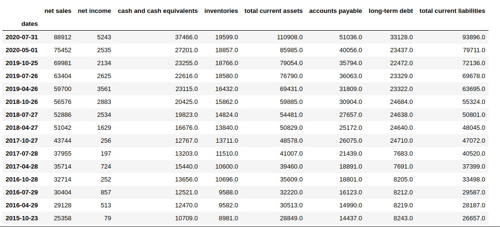
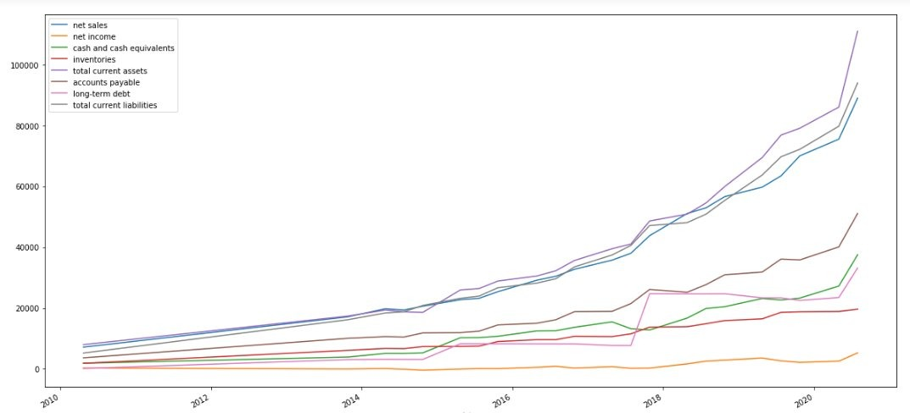

Although there is no documentation at the moment, you will be able to see each step of the webscrapping and data serialization process in the jupyter notebook "download finantial statements.ipynb"

here a couple of screenshots of the results, an example of Amazon financial data extracted and serialized:

### -------------------------------------

### In the next few days I will be updating the readme with the project documentation, sorry for the inconvenience

